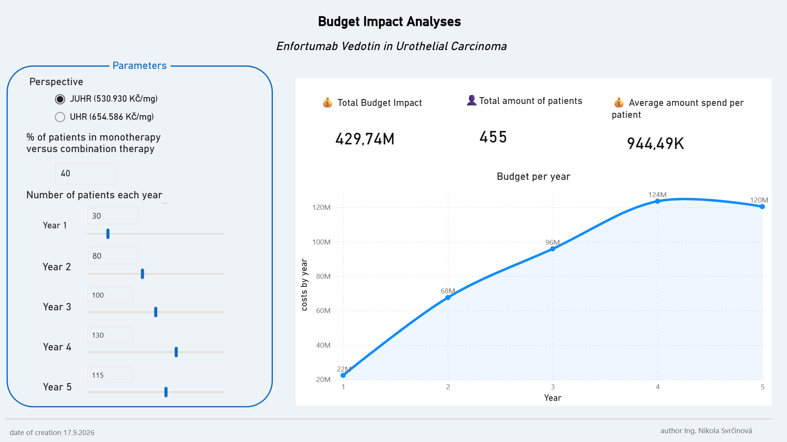

# Budget Impact Model – Padcev (enfortumab vedotin)
## Urothelial carcinoma | Czech payer perspective | 5-year horizon

An interactive model of the 5-year budget impact on a Czech payer's budget when reimbursing enfortumab vedotin. The project combines a Python-based patient population simulation with an interactive Power BI dashboard.

## Objective

Estimate the 5-year impact on public health insurance spending from
reimbursing enfortumab vedotin, with the ability to interactively change
key assumptions:
1. price
   * JUHR = Jádrová úhrada/core reimbursement is the amount that the public health insurance system reimburses
   *  UHR = JUHR + pharmacy/distribution margin + VAT
2. % of patients in monotherapy vs combination therapy
3. population size each year.

## Key features

- **Monte Carlo simulation of patient weight** (10,000 patients, lognormal
  distribution) – dosing is weight-based (1.25 mg/kg), so a realistic
  estimate of consumption and drug wastage is required.
- **Drug wastage modelling** – because the dose is rounded up to the vial
  size (20/30 mg), wastage is computed per patient. The mean of rounded
  doses ≠ the rounding of the mean dose (Jensen's inequality), which is why
  the model simulates a population instead of using an "average patient".
- **Two treatment regimens** – monotherapy (2nd line) and combination with
  pembrolizumab (1st line), with an adjustable share of patients.
- **Treatment carry-over coefficient between years** – treatment started in
  a given year often extends into the next; the model splits the cost using
  the coefficient 1 − D/730 (D = median treatment duration in days).
- **What-if parameters** – price per mg, regimen mix, population size, and the uptake curve.

## Methodology

1. **Dose per patient**: required dose = min(weight × 1.25, 125) mg;
   prepared dose = rounded up to nearest 10 mg (min. 20 mg).
2. **Wastage**: prepared dose − required dose (in mg).
3. **Administrations per course**: (treatment duration / cycle length) ×
   administrations per cycle. Monotherapy ≈ 16; combination ≈ 18.
4. **Patients treated per year**: eligible patients × uptake rate.
5. **Carry-over between years**: share of a course falling in the starting
   year = 1 − D/730; the remainder falls into the following year.
6. **Annual cost** = treated patients × prepared dose × administrations ×
   price per mg, split across years via the carry-over coefficient.

## Data sources
- **Sex distribution**: ÚZIS ČR / Uroweb – epidemiology of urogenital cancers in the Czech Republic (NOR data, C67, 1 559 men and 540 women)
- **Body weight**: ÚZIS ČR, Aktuální informace 70/2010 (EHIS 2008), https://www.uzis.cz/sites/default/files/knihovna/70_10.pdf
- **Variance of body weight**: SZÚ – EHES 2019 (measured height/weight/BMI, Czech adults) https://szu.gov.cz/wp-content/uploads/2023/01/ehes2022.pdf
- **Treatment duration**:
  EV-301 – Powles T. et al., N Engl J Med 2021;384:1125-1135, https://doi.org/10.1056/NEJMoa2035807
  EV-302 – Powles T. et al., N Engl J Med 2024, https://doi.org/10.1056/NEJMoa2312117

## Limitations
- **Gross, not net, budget impact** – the model estimates the cost of enfortumab vedotin only. Costs of pembrolizumab in the combination regimen and of displaced therapies (platinum-based chemotherapy) are not offset, so the net impact on the payer is lower than shown.
- **Weight distribution** – lognormal with Czech mean weights
- **No dose modifications** – dose reductions, delays and interruptions are not modelled, which overestimates consumption.
- **No vial sharing** – wastage is computed per patient; centres that pool vials would see lower wastage.
- **Treatment duration** is the trial median applied deterministically, with no time-on-treatment curve; real-world patients tend to be older with more comorbidities, so actual duration may be shorter.
- **List prices** – confidential discounts and risk-sharing agreements are not reflected.
- **Uptake curve** is an assumption and should ideally be sourced from the SÚKL assessment report.
- **Fixed 5-year window** – courses starting in year 5 are counted only up to year-5 consumption.
interactive dashboard and what-if parameters.
